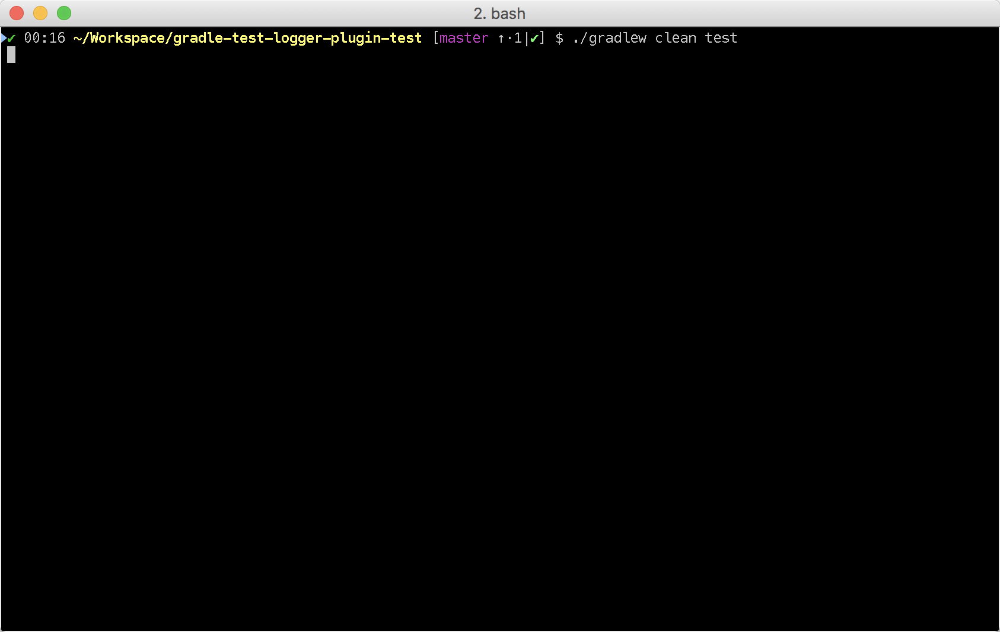

# Gradle Test Logger Plugin [](https://circleci.com/gh/radarsh/gradle-test-logger-plugin)

A Gradle plugin for printing beautiful logs on the console while running tests.

## Standard theme


## Mocha theme



## Usage

### Modern Gradle

```groovy
plugins {
    id 'com.adarshr.test-logger' version '1.0.0'
}
```

### Gradle < 2.1

```groovy
buildscript {
  repositories {
    maven {
      url 'https://plugins.gradle.org/m2/'
    }
  }
  dependencies {
    classpath 'com.adarshr:gradle-test-logger-plugin:1.0.0'
  }
}

apply plugin: 'com.adarshr.test-logger'
```

## Configuration

### Switch themes

```groovy
testlogger {
    theme 'mocha'
}
```

The following themes are currently supported:

1. `plain` - displays no colours or Unicode symbols
2. `standard` - displays colours but no Unicode symbols
3. `mocha` - similar to what mochajs/mocha prints including Unicode symbols.

## FAQ

### Does it work on Windows?

Mostly. The `standard` and `plain` themes work out of the box but you might have to make a few modifications to your system settings to see Unicode
symbols when using the `mocha` theme.

1. Export `JAVA_OPTS` with a system property `-Dfile.encoding=UTF-8`.
2. Change the terminal code page to 65001 by executing `chcp 65001`.

### How to switch off colours on Jenkins console?

You can switch off ANSI escape sequences and Unicode symbols on Jenkins by running your Gradle build with the argument `--console=plain`
